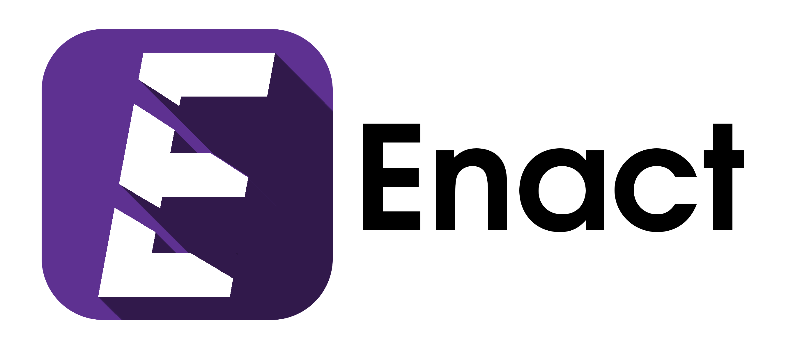

<p align="center">
</img><br>
Enact is a new programming language that's not designed to be unique or groundbreaking. Instead, Enact takes already 
established technologies and paradigms and just makes them <strong>nicer</strong>.
</p>

## Example
```
// FizzBuzz in Enact

each i in 1..20:
    given i % 3 == 0, i % 5 == 0:
        when true, true:
            print("FizzBuzz")
        when true, false:
            print("Fizz")
        when false, true:
            print("Buzz")
        else:
            print(i)
    end
end
```

## Goals
- Enact aims to make dealing with data easier through a variety of high-level but high-performance constructs.
- It should be powerful, but shouldn't have a giant learning curve.
- Code should be logical and pretty, not hacky and weird.
- Existing, proven ideas are what make up the language, not strange, foriegn concepts.
